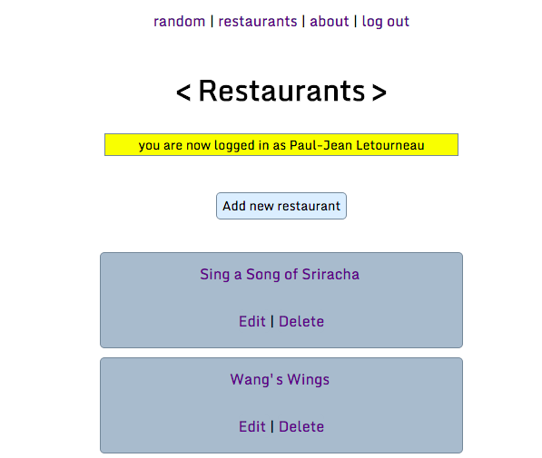
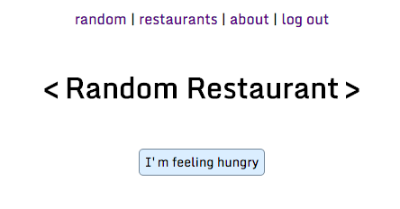
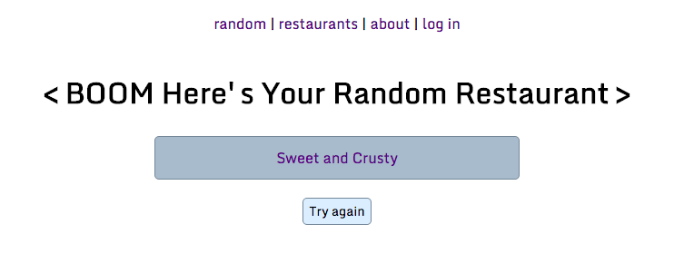
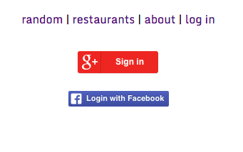

# Random Noms

## App features

Random Noms is a simple web app that allows users to log in and create and add menus for their own restaurants.
Users can then get randomly selected restaurants from the full database of restaurants added by all users.

See the full list of restaurants (and edit the list if the user is logged in):



Users can click the "I'm feeling hungry" button on the homepage:



... and get a randomly selected restaurant to eat at:



## App setup

Start the app locally using `python`:

``` bash
    vagrant@vagrant-ubuntu-trusty-32:/vagrant/random-noms$ python project.py
     * Running on http://0.0.0.0:5000/
     * Restarting with reloader
```

... and navigate to `localhost` port 5000.

## Social sign-on

The app allows the user to log in via Google+ and Facebook social sign-on buttons:



### Google+

The Google+ social sign-on _hybrid auth flow_ proceeds in several token exchanges:

    * user clicks the G+ sign-in button
    * app server validates the `state token` on the page
    (ensuring the page was generated by the app server, guarding against cross-site scripting attacks)
    * client is redirected to the G+ sign-in portal, where user authorizes the app (using G+ JS client API)
    * G+ server sends a `one-time code` back to the client
    * client forwards the `one-time code` to the app server
    * app server relays the `one-time code` _back_ to the G+ API server (via G+ [OAuth v2](https://accounts.google.com/o/oauth2/auth) callback URL)
    * G+ API verifies the `one-time code` has made a round-trip via the app server, and replies with a long-lived `access token`
    * app server uses the long-lived `access token` to make further G+ API calls on behalf of the user

The G+ sign-on requires a file called `client_secrets.json` to authenticate the app with the G+ API server,
which can be downloaded from the [Google developer site](https://console.developers.google.com).

### Facebook

The Facebook social sign-on auth flow proceeds much the same as for G+, with a short-lived access code
provided by the FB API going round-trip through the app server, and upgraded to a long-lived
access token via the FB OAuth v2 API server.

The FB sign-on requires a file called `fb_client_secrets.json` to authenticate the app with the FB API server.
The file needs to contain an `app_id` and `app_secret`, which can be obtained [Facebook developer site](https://developers.facebook.com/apps),
in the following format:

``` javascript
    {
        "web": {
            "app_id": "XXXXXXX",
            "app_secret": "XXXXXX"
        }
    }
```
